# 谷歌插件superSearchPlus（最新更新时间 2022-11-28）
# 更新

2022-11-27 第八次更新
```
1.优化 注释扫描功能界面ui增加检索功能 注释扫描 提示 
2.新增接口扫描 根据选项设置扫描的类型 匹配扫描的内容 进行提示
```
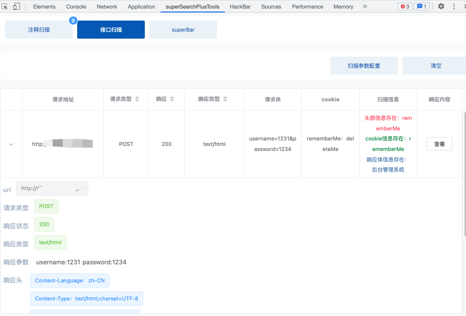

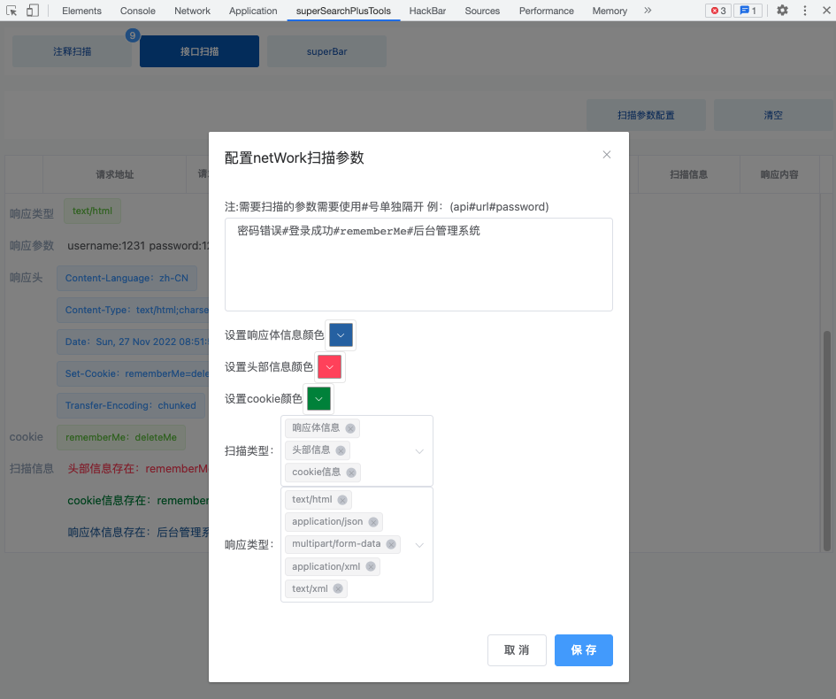
2022-11-25 第七次更新
```
1.优化 注释扫描功能界面ui 
2.新增superBar 重发请求功能（仿造hackBar）
```
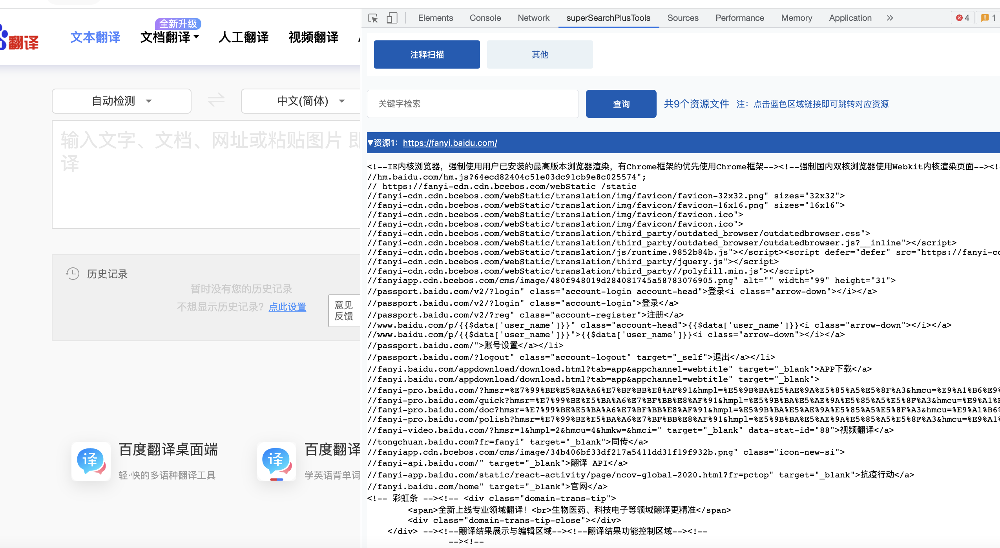
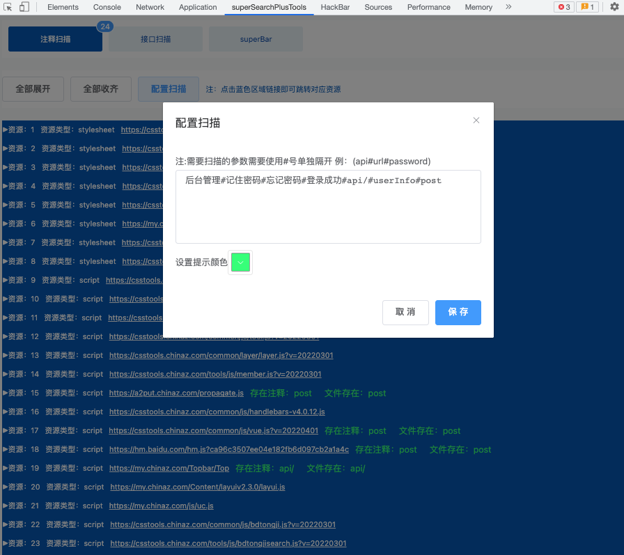
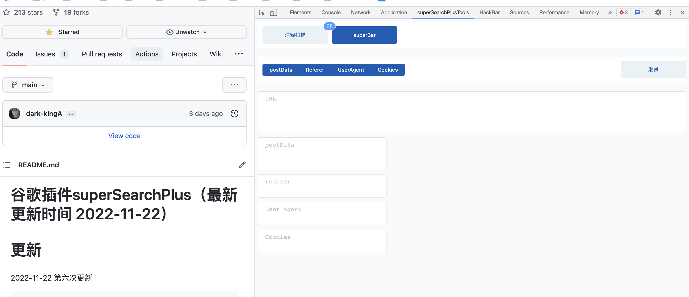
2022-11-22 第六次更新
```
1.增加右键检查中 注释扫描功能界面
```
2022-11-21 第五次更新
```
1.增加ip归属地
2.添加fofa搜索一键跳转网页
3.工具栏添加解密（其他解密等待中）
```
2022-11-4 第四次更新
```
1.增加了综合查询中 ip位置 鼠标移入 快捷查询
2.综合查询中添加输入框 默认自动获取当前tab的url 现可以手动输入 想要查询 ip/域名
3.修改部分bug
```
2022-11-3 第三次更新
```
1.ip反查域名功能优化 （供操作者手动选择域名查询）
2.优化了弹窗
3.修改部分bug
```
2022-11-2 第二次更新
```
1.修复了 ip反查域名失败 （需手动先登录）
2.修改部分bug
```
2022-11-1 第一次更新 
```
1.上线了 quake查询
2.修复了鹰图api 时间筛选报错问题
3.添加工具 shell命令
```


# 0x01 开发初衷
superSearchPlus是聚合型信息收集插件，支持综合查询，资产测绘查询，信息收集 整合了目前常见的资产测绘平台 同时支持数据导出
本插件是superSearch的翻版（https://github.com/dark-kingA/superSearh.git）
新版全新ui以及渲染速度大大提示了
新版地址 （https://github.com/dark-kingA/superSearchPlus.git）
开发初期就是为了解决快速收集目标信息而做的 后来越做越上头 就都集成了（狗头）

# 0x02 安装与使用

1、直接拖入google对扩展程序中即可使用

2、Github项目地址
https://github.com/dark-kingA/superSearchPlus.git


# 0x03 功能描述
## ip反查域名功能 （可手动选择指定域名查询）

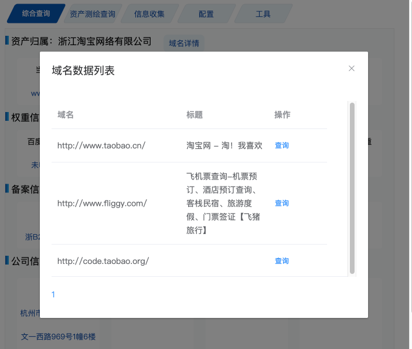
## 1.提取当前tab的url进行扫描查询
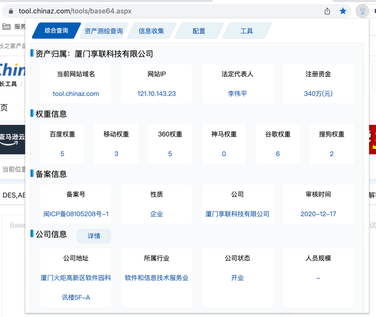
### 公司基本信息查询
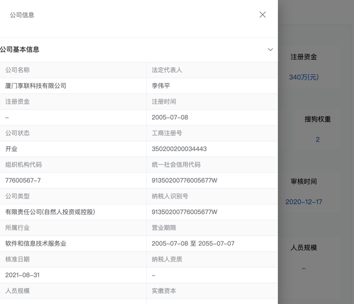
## 2.资产测绘查询
根据当前解析出来的ip进行资产测绘查询
### fofa查询
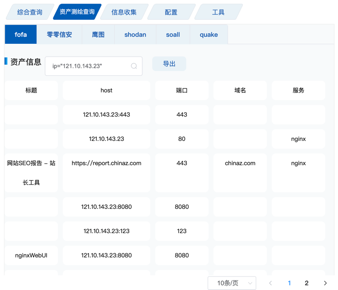
### 零零信安
默认根据当前查询的公司作为查询项
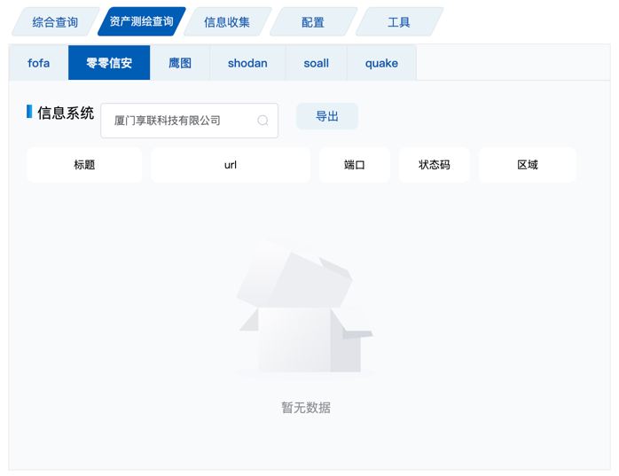
### 鹰图
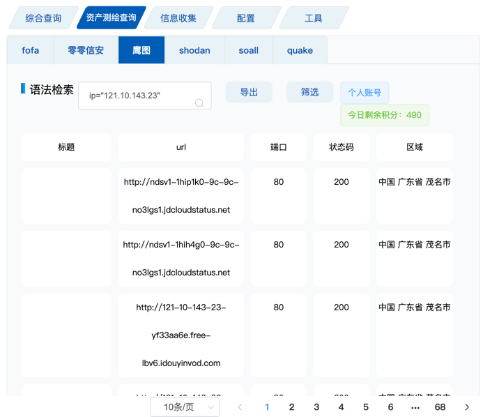
支持数据筛选 (默认时间是近一年 可手动选择)
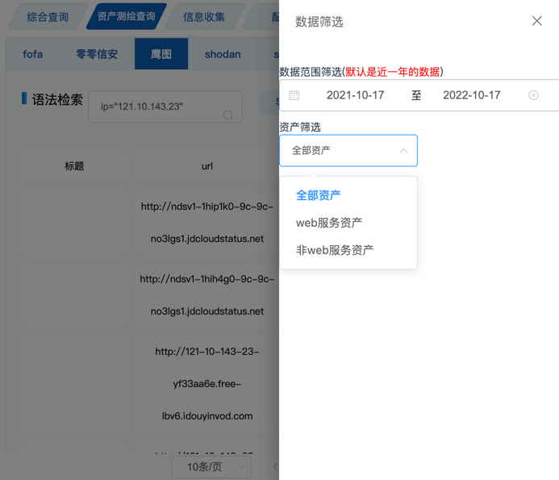
### shodan
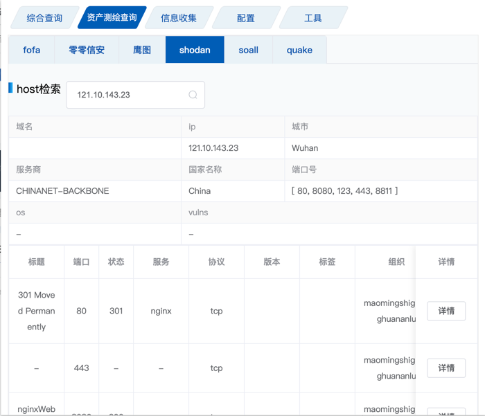
同时支持数据的json查询 防止插件 有重要数据未展示
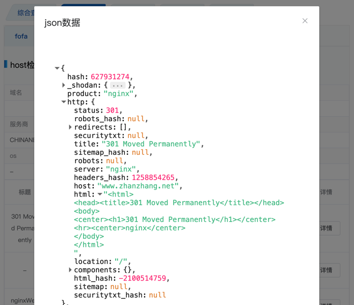
### soall
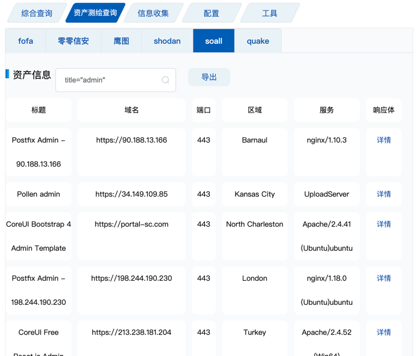
支持查看响应体信息数据展示
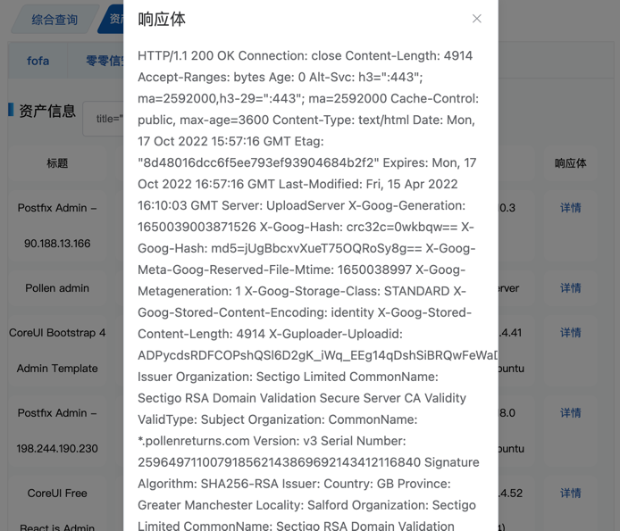
### quake
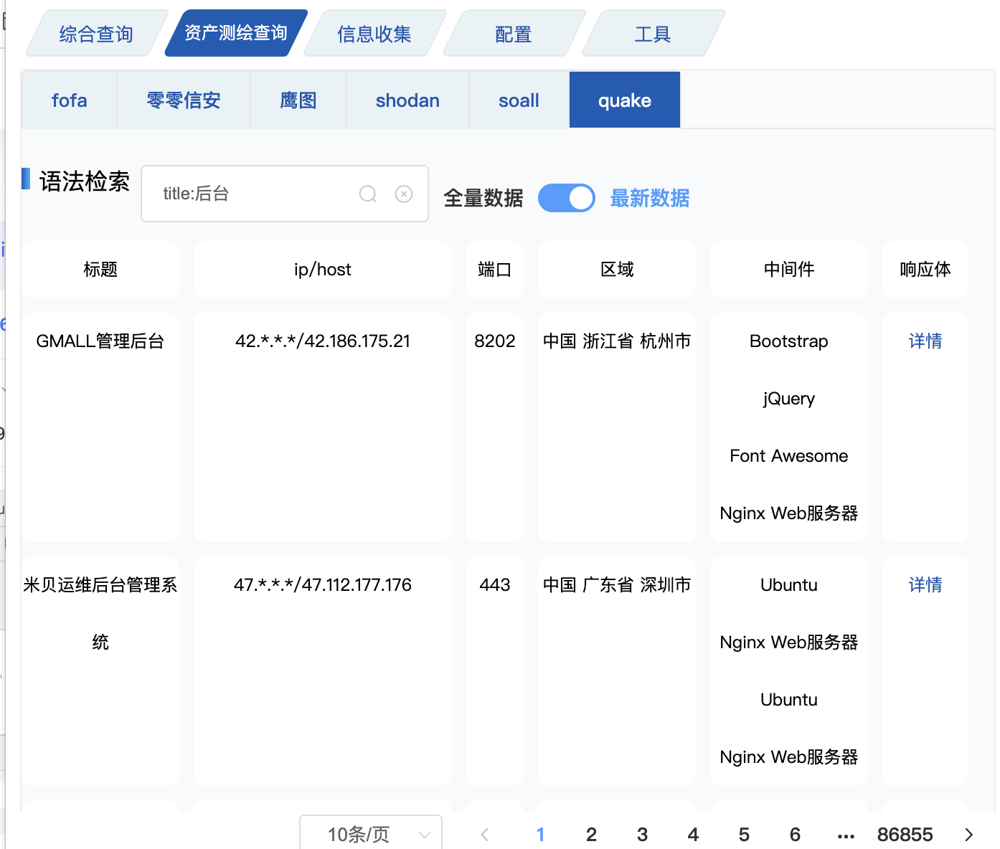

## 3.信息收集
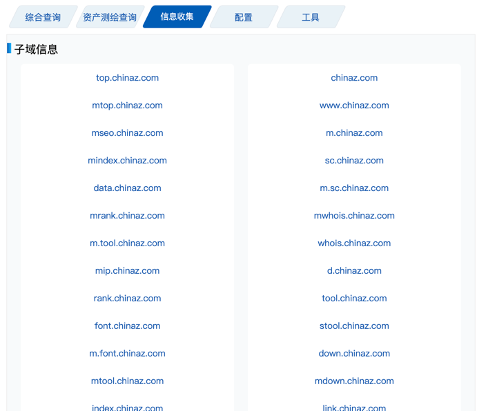
## 4.配置
初始化时 可以点击导出配置json文件
然后去对应平台拿到api的key放入json文件中
导入配置即可 或者可以手动一条一条添加 保存即可
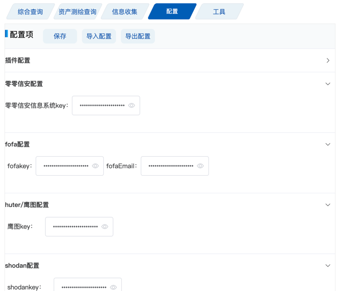
## 5.工具
解密
反弹shell

## 6.superSearchPlusTools 注释扫描功能

## 7.superBar 重发请求功能（仿造hackBar）


# 0x04 技术交流
有任何的技术问题和反馈联系本人即可


